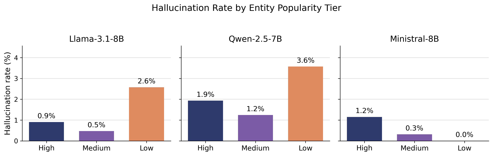
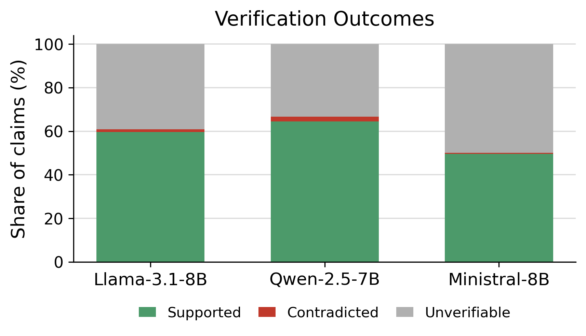

# KGHallucinate

<a href="https://colab.research.google.com/github/YOUR_USERNAME/YOUR_REPO_NAME/blob/main/Pipeline_Colab.ipynb" target="_parent"></a>

This repository contains the full codebase and dataset for evaluating hallucination rates in Large Language Models (LLMs) across different entities, segmented by their popularity. 

## 🎯 Project Overview

The core hypothesis of this project is that LLM hallucination rates increase as the popularity of the queried entity decreases, primarily due to sparser representation in their training data. 

To test this, I evaluated three instruction-tuned models of similar parameter size (`meta-llama/Llama-3.1-8B-Instruct`, `Qwen/Qwen2.5-7B-Instruct`, and `mistralai/Ministral-8B-2512`) across 60 scientists. These entities are categorized into **High**, **Medium**, and **Low** popularity tiers based on their Wikidata sitelink counts.

---

## 📊 Results & Visualization

My findings indicate a clear correlation between entity popularity and hallucination rates.





---

## 🏗️ Pipeline Architecture

The project is structured as a sequential data pipeline. Each step is encapsulated in its own script for modularity and easy reproduction.

1. **Entity Collection (`1_collect_entities.py`)**: 
   Fetches ground-truth facts for 60 entities from Wikidata via SPARQL and the EntityData API.
2. **Biography Generation (`2_generate_bios.py`)**: 
   Prompts the three open-weights models via OpenRouter to generate short biographies for each entity.
3. **Claim Decomposition (`3_decompose_claims.py`)**: 
   Uses an LLM to decompose the generated paragraphs into atomic, single-fact sentences (following a FActScore-style approach).
4. **Claim Verification (`4_verify_claims.py`)**: 
   Uses a local Natural Language Inference (NLI) model (`roberta-large-mnli`) to strictly verify each atomic claim against the structured Wikidata facts.
5. **Results Analysis (`5_analyze_results.py`)**: 
   Aggregates the verification data, calculates global and tier-based hallucination rates, exports to Excel, and generates the visual charts.

---

## 🚀 How to Run Locally

If you want to run the full pipeline from scratch:

### 1. Prerequisites
Clone the repository and install the required dependencies:
```bash
git clone https://github.com/YOUR_USERNAME/YOUR_REPO_NAME.git
cd YOUR_REPO_NAME
pip install -r requirements.txt
```

### 2. Environment Variables
To generate biographies and decompose claims, you need an OpenRouter API key. 
Create a `.env` file in the root directory (you can use `.env.example` as a template):
```env
OPENROUTER_API_KEY=your_api_key_here
```

### 3. Execution
Run the pipeline scripts sequentially. (Note: Step 4 runs a local NLI model and requires a machine with sufficient memory/GPU resources for inference).

```bash
python 1_collect_entities.py
python 2_generate_bios.py
python 3_decompose_claims.py
python 4_verify_claims.py
python 5_analyze_results.py
```

---

## 📂 Data Structure

All generated outputs and raw statistics are stored in the `data/` and `results/` folders.
- `data/verified.json`: The final JSON containing the atomic claims, the truth values, and the NLI confidence scores.
- `results/hallucination_results.xlsx`: Contains full statistical breakdowns and raw claim-level verdicts in a readable spreadsheet.
- `results/figures/`: Contains the generated matplotlib charts.

## 🤝 Colab Quickstart

Don't want to set up the local pipeline? You can instantly run the pipeline using Google Colab. Just open the provided `Pipeline_Colab.ipynb` notebook (click the Colab badge at the top).

**Recommendation:** The repository already contains the downloaded Wikidata ground truth facts (`data/entities.json`). I recommend that users testing the project start directly at **Step 2** in the notebook to jump straight into the LLM Generation pipeline! If you want to customize the dataset and query new people, you can run Step 1.
