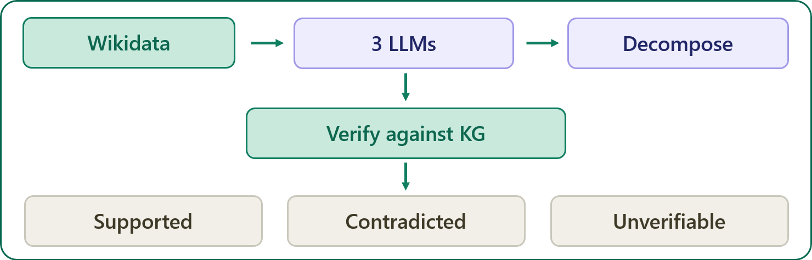

# Knowledge-Graph-Based Hallucination Detection in LLMs

<a href="https://colab.research.google.com/github/omrusman/KGHallucinate/blob/main/Pipeline_Colab.ipynb" target="_parent"></a>
## 🤝 Colab Quickstart

Don't want to set up the local pipeline? You can instantly run the pipeline using Google Colab. Just open the provided `Pipeline_Colab.ipynb` notebook (click the Colab badge at the top).
Recommendation: The repository already contains the downloaded Wikidata ground truth facts (`data/entities.json`). For testing the project start directly at **Step 2** in the notebook to jump straight into the LLM Generation pipeline! If you want to customize the dataset and query new people, you can run Step 1.

---

This repository contains the full codebase and dataset for evaluating hallucination rates in Large Language Models (LLMs) across different entities, segmented by their popularity.

## 🎯 Project Overview

The core hypothesis of this project is that LLM hallucination rates increase as the popularity of the queried entity decreases, primarily due to sparser representation in their training data.

To test this, I evaluated three instruction-tuned models of similar parameter size (`meta-llama/llama-3.1-8b-instruct`, `qwen/qwen-2.5-7b-instruct`, and `mistralai/ministral-8b-2512`) across 60 scientists. These entities are categorized into **High**, **Medium**, and **Low** popularity tiers based on their Wikidata sitelink counts.

Wikidata serves as the knowledge graph here: entities are nodes, relations are edges, and nine fact properties are extracted per scientist. Unlike retrieval-augmented generation, the graph is never given to the model at generation time — it is used only for post-hoc verification, so what is measured is unaided parametric knowledge.

---

## 🏗️ Pipeline Architecture

The project is structured as a sequential data pipeline. Each step is encapsulated in its own script for modularity and easy reproduction.

<p align="center">
  
</p>

1. **Entity Collection (`1_collect_entities.py`)**: 
   Fetches ground-truth facts for 60 entities from Wikidata via SPARQL and the EntityData API.
2. **Biography Generation (`2_generate_bios.py`)**: 
   Prompts the three open-weights models via OpenRouter to generate short biographies for each entity at temperature 0.
3. **Claim Decomposition (`3_decompose_claims.py`)**: 
   Uses an LLM to decompose the generated paragraphs into atomic, single-fact sentences (following a FActScore-style approach).
4. **Claim Verification (`4_verify_claims.py`)**: 
   Verifies each atomic claim against the structured Wikidata facts in two stages — a literal substring match against fact values, then a local NLI model (`roberta-large-mnli`) for paraphrased claims. Only single-valued fields (birth date, birthplace) can yield a contradiction; multi-valued fields such as employer or awards cannot, since matching a different true item is not a contradiction.
5. **Results Analysis (`5_analyze_results.py`)**: 
   Aggregates the verification data, calculates global and tier-based hallucination rates, exports to Excel, and generates the visual charts.

---

## 📊 Results & Visualization

### Headline finding

Two of the three models hallucinated most on low-popularity entities, but the effect is **not universal** — Ministral-8B showed the opposite pattern.

<p align="center">
  
</p>

<div align="center">

<table>
<tr><th>Model</th><th>High</th><th>Medium</th><th>Low</th></tr>
<tr><td>Llama-3.1-8B</td><td>0.9%</td><td>0.5%</td><td><b>2.6%</b></td></tr>
<tr><td>Qwen-2.5-7B</td><td>1.9%</td><td>1.2%</td><td><b>3.6%</b></td></tr>
<tr><td>Ministral-8B</td><td><b>1.2%</b></td><td>0.3%</td><td>0.0%</td></tr>
</table>

</div>

Llama and Qwen behave as the popularity hypothesis predicts. Ministral-8B does not: its highest rate is on the *most* famous entities. Since all three models sit in the same 7–9B parameter range, scale alone does not predict factual behaviour — training data and alignment differ enough to reverse the trend.

### Verification coverage

<p align="center">
  
</p>

<div align="center">

<table>
<tr><th>Model</th><th>Supported</th><th>Contradicted</th><th>Unverifiable</th></tr>
<tr><td>Llama-3.1-8B</td><td>59.6%</td><td>1.3%</td><td>39.1%</td></tr>
<tr><td>Qwen-2.5-7B</td><td>64.5%</td><td>2.2%</td><td>33.3%</td></tr>
<tr><td>Ministral-8B</td><td>49.6%</td><td>0.5%</td><td>49.8%</td></tr>
</table>

</div>

Between a third and half of all claims could not be verified either way. Two causes: Wikidata simply lacks the relevant property (e.g. it records *that* Einstein won a Nobel Prize, not the year), and the NLI model misses paraphrases — it does not recognise "E=mc²" as a restatement of "mass–energy equivalence".

### High-tier errors are mostly artifacts

Manual inspection of all 23 contradictions found a qualitative split. Every high-tier case stems from a representation mismatch rather than a fabricated fact:

- **Calendar systems** — all three models gave Newton's birth as 4 January 1643 (Gregorian); Wikidata records 1642 (Julian).
- **Location granularity** — models said Turing was born in "Maida Vale, London"; Wikidata records "Warrington Lodge", a building *within* Maida Vale. Faraday and Mendeleev were flagged the same way.

Low-tier contradictions are genuine errors with no alternative reading — Willis Lamb placed in Chicago rather than Los Angeles, Owen Chamberlain in Detroit rather than San Francisco, Janus Friis born in 1972 rather than 1976.

If that reading holds, the true popularity gap is **wider** than the chart shows, since the high-tier bars are inflated by measurement artifacts.

### Caveats

- All 23 contradictions come from `birthplace` (16) or `date_of_birth` (7). Only single-valued fields can produce a contradiction by design, so this is a **birth-fact** hallucination rate, not a general one.
- Per-tier contradiction counts range from 0 to 10 claims. Trends are suggestive, not statistically robust.
- Cross-family comparison controls for parameter scale but not for training data, so differences cannot be attributed to architecture alone.

---

## 🚀 How to Run Locally

If you want to run the full pipeline from scratch:

### 1. Prerequisites
Clone the repository and install the required dependencies:
```bash
git clone https://github.com/omrusman/KGHallucinate.git
cd KGHallucinate
pip install -r requirements.txt
```

### 2. Environment Variables
To generate biographies and decompose claims, you need an OpenRouter API key. 
Create a `.env` file in the root directory (you can use `.env.example` as a template):
```env
OPENROUTER_API_KEY=your_api_key_here
```

### 3. Execution
Run the pipeline scripts sequentially. (Note: Step 4 runs a local NLI model and requires a machine with sufficient memory/GPU resources for inference. On CPU the full ~2,000-claim dataset can take several hours; on a free Colab T4 GPU it takes roughly 20 minutes.)

```bash
python 1_collect_entities.py
python 2_generate_bios.py
python 3_decompose_claims.py
python 4_verify_claims.py
python 5_analyze_results.py
```

---

## 📂 Data Structure

All generated outputs and raw statistics are stored in the `data/` and `results/` folders.
- `data/verified.json`: The final JSON containing the atomic claims, the truth values, and the NLI confidence scores.
- `results/hallucination_results.xlsx`: Contains full statistical breakdowns and raw claim-level verdicts in a readable spreadsheet.
- `results/figures/`: Contains the generated matplotlib charts.


